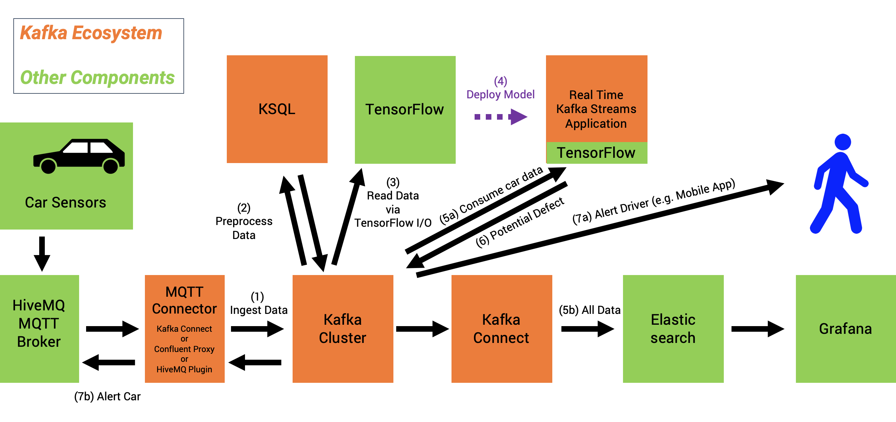
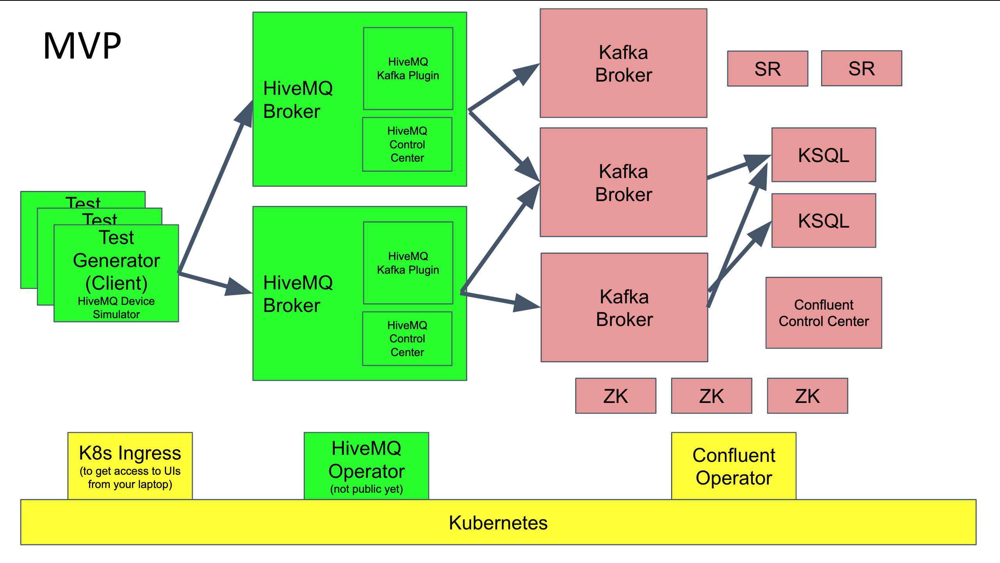
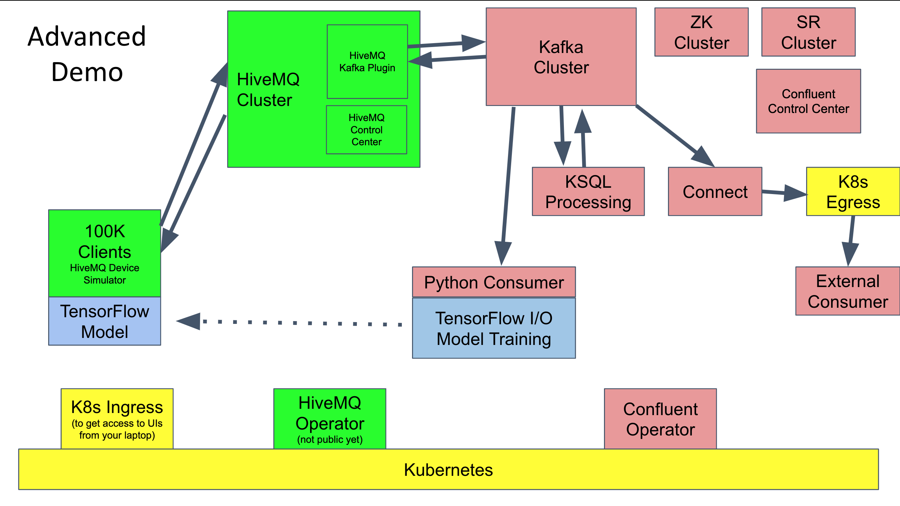
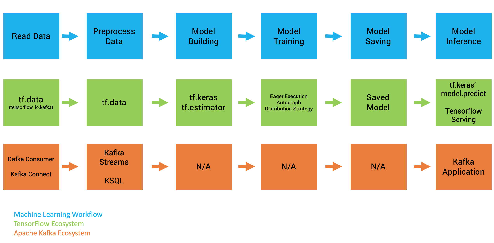
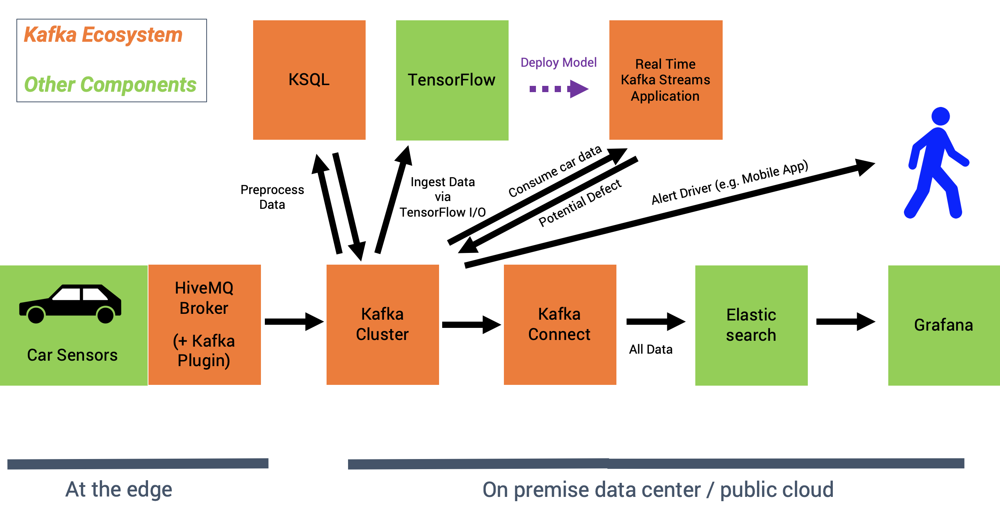

# Streaming Machine Learning at Scale from 100000 IoT Devices with HiveMQ, Apache Kafka and TensorFLow

================
WORK IN PROGRESS... NOT FINISHED YET !!!!!!
The infrastructure is set up; but optimizations and the streaming ML part is still missing... Goal is to finish V2 (i.e. end-to-end integration at scale, including Streaming ML) until end of October 2019. ================

If you just want to get started and quickly start the demo in a few minutes, go to the [quick start](infrastructure/README.md) to setup the infrastructure (on GCP) and run the demo.

## Movitation: Demo an IoT Scenario at Scale

You want to see an IoT example at huge scale? Not just 100 or 1000 devices producing data, but a really scalable demo with millions of messages per second from tens of thousands of devices?

This is the right demo for you! The demo shows how you can integrate with tens or hundreds of thousands IoT devices and process the data in real time. The demo use case is anomaly detection in a connected car infrastructure.

## Use Case: Anomaly Detection in Real Time for 100000+ Connected Cars

Streaming Machine Learning in Real Time at Scale with MQTT, Apache Kafka and TensorFlow I/O:

- Data Integration
- Data Preprocessing
- Model Training
- Model Deployment
- Real Time Scoring
- Real Time Monitoring

This project implements a scenario where you can integrate with tens of thousands devices using a scalable IoT platform and an event streaming platform. The demo trains new analytic models from streaming data - without the need for an additional data store - to do anomaly detection on real time sensor data from cars:

## Architecture

We use [HiveMQ](https://github.com/hivemq/hivemq-community-edition) as open source MQTT broker to ingest data from IoT devices, ingest the data in real time into an [Apache Kafka](https://github.com/) cluster for preprocessing (using Kafka Streams / [KSQL](https://github.com/confluentinc/ksql)), and model training (using [TensorFlow 2.0](https://www.tensorflow.org/) and its Kafka IO plugin). 

We leverage additional enterprise components from HiveMQ and Confluent to allow easy operations, scalability and monitoring.

Here is the architecture of the MVP (already implemented and working):

And this is the architecture of the final demo (target: End of October 2019):

### Test Data - Car Sensors

We generate streaming test data at scale using a [Car Data Simulator](https://github.com/sbaier1/avro-car-sensor-simulator). The test data uses Apache Avro file format to leverage features like compression, schema versioning and Confluent features like Schema Registry or KSQL's schema inference.

You can either use some test data stored in the CSV file [car-sensor-data.csv](testdata/car-sensor-data.csv) or generate continuous streaming data using the script (as described in the quick start). Check out the Avro file format here: [cardata-v1.avsc](cardata-v1.avsc).

Here is the schema and one row of the test data:

    time,car,coolant_temp,intake_air_temp,intake_air_flow_speed,battery_percentage,battery_voltage,current_draw,speed,engine_vibration_amplitude,throttle_pos,tire_pressure_1_1,tire_pressure_1_2,tire_pressure_2_1,tire_pressure_2_2,accelerometer_1_1_value,accelerometer_1_2_value,accelerometer_2_1_value,accelerometer_2_2_value,control_unit_firmware

    1567606196,car1,39.395103,34.53991,123.317406,0.82654595,246.12367,0.6586535,24.934872,2493.487,0.034893095,32,31,34,34,0.5295712,0.9600553,0.88389874,0.043890715,2000

## Streaming Ingestion and Model Training with Kafka and TensorFlow-IO

Typically, analytic models are trained in batch mode where you first ingest all historical data in a data store like HDFS, AWS S3 or GCS. Then you train the model using a framework like Spark MLlib, TensorFlow or Google ML.

[TensorFlow I/O](https://github.com/tensorflow/io) is a component of the TensorFlow framework which allows native integration with various technologies.

One of these integrations is tensorflow_io.kafka which allows streaming ingestion into TensorFlow from Kafka WITHOUT the need for an additional data store! This *significantly simplifies the architecture  and reduces development, testing and operations costs*.
Yong Tang, member of the SIG TensorFlow I/O team, did a [great presentation about this at Kafka Summit 2019 in New York](https://www.confluent.io/kafka-summit-ny19/real-time-streaming-with-kafka-and-tensorflow) (video and slide deck available for free).

You can pick and choose the right components from the Apache Kafka and TensorFlow ecosystems to build your own machine learning infrastructure for data integration, data processing, model training and model deployment:

This demo will do the following steps:

- Consume streaming data from MQTT Broker HiveMQ via a Kafka Consumer
- Preprocess the data with KSQL (filter, transform)
- Ingest the data into TensorFlow  (tf.data and tensorflow-io)
- Build, train and save the model  (TensorFlow 2.0 API)
- Deploy the model within a Kafka Streams application for embedded real time scoring

Optional steps (nice to have)

- Show IoT-specific features with HiveMQ tool stack
- Deploy the model via TensorFlow Serving
- Some kind of A/B testing
- Re-train the model and updating the Kafka Streams application (via sending the new model to a Kafka topic)
- Monitoring of model training (via TensorBoard) and model deployment / inference (via some kind of Kafka integration + dashboard technology)
- Confluent Cloud for Kafka as a Service (-> Focus on business problems, not running infrastructure)
- Enhance demo with C / librdkafka clients and TensorFlow Lite for edge computing
- todo - other ideas?

## Why is this so awesome

Again, you don't need another data store anymore! Just ingest the data directly from the distributed commit log of Kafka:

## Be aware: This is still NOT Online Training

Streaming ingestion for model training is fantastic. You don't need a data store anymore. This simplifies the architecture and reduces operations and developemt costs.

However, one common misunderstanding has to be clarified - as this question comes up every time you talk about TensorFlow I/O and Apache Kafka: As long as machine learning / deep learning frameworks and algorythms expect data in batches, you cannot achieve real online training (i.e. re-training / optimizing the model with each new input event).

Only a few algoryhtms and implementations are available today, like Online Clustering.

Thus, even with TensorFlow I/O and streaming ingestion via Apache Kafka, you still do batch training. Though, you can configure and optimize these batches to fit your use case. Additionally, only Kafka allows ingestion at large scale for use cases like connected cars or assembly lines in factories. You cannot build a scalable, reliable, mission-critical ML infrastructure just with Python.

The combination of TensorFlow I/O and Apache Kafka is a great step closer to real time training of analytic models at scale!

I posted many articles about videos about this discussion. Get started with [How to Build and Deploy Scalable Machine Learning in Production with Apache Kafka](https://www.confluent.io/blog/build-deploy-scalable-machine-learning-production-apache-kafka/) and check out my other resources if you want to learn more.

## Requirements and Setup

### Full Live Demo for End-to-End MQTT-Kafka Integration

We have prepared a terraform script to deploy the complete environment in Google Kubernetes Engine (GKE). This includes:

- Kafka Cluster: Apache Kafka, KSQL, Schema Registry, Control Center
- MQTT Cluster: HiveMQ Broker, Kafka Plugin, Test Data Generator
- Machine Learning: TensorFlow I/O and Kafka Plugin
- Monitoring infrastructure: Prometheus, Grafana, Control Center

The setup is pretty straightforward. No previous experience required for getting the demo running. You just need to install some CLIs on your laptop (gcloud, kubectl, helm, terraform).

With default configuration, the demo starts at small scale. This is sufficient to show an impressive demo. It also reduces cost and to enables free usage without the need for commercial licenses. You can also try it out at extreme scale (100000+ IoT connections). This option is also described in the quick start.

Afterwards, you execute one single command to set up the infrastructure and one command to generate test data. Of course, you can configure everything to your needs (like the cluster size, test data, etc).

Follow the instructions in the [quick start](infrastructure/README.md) to setup the cluster.

### Streaming ML with Kafka and TensorFlow

If you are just interested in the "Streaming ML" part, check out the following:

Until the full demo is ready, you can already checkout two working examples which use Kafka Python clients to produce data to Kafka topics and then consume the streaming data directly with TensorFlow I/O for streaming ML without an additional data store:

- [Streaming ingestion of MNIST data into TensorFlow via Kafka for image regonition](confluent-tensorflow-io-kafka.py).
- Autoencoder for anomaly detection of sensor data into TensorFlow via Kafka. [Producer (Python Client)](https://github.com/kaiwaehner/hivemq-mqtt-tensorflow-kafka-realtime-iot-machine-learning-training-inference/blob/master/python-scripts/autoencoder-anomaly-detection/Sensor-Kafka-Producer-From-CSV.py) and [Consumer (TensorFlow I/O Kafka Plugin) + Model Training](https://github.com/kaiwaehner/hivemq-mqtt-tensorflow-kafka-realtime-iot-machine-learning-training-inference/blob/master/python-scripts/autoencoder-anomaly-detection/Sensor-Kafka-Consumer-and-TensorFlow-Model-Training.py).

## More Information

TODO Outsource to TensorFlow section / folder when available.

### TensorFlow 2.0 is still beta and requires Linux

- At the time of writing (July 2019), TensorFlow 2.0 is still beta
- TensorFlow 2.0 I/O does NOT work on Mac or Windows (e.g. 'pip install tensorflow-io-2.0-preview does not work'). You need to install it on a Linux system (VM or Cloud Instance) to avoid many headaches and spend your time on the problem, not the infrastructure

### TensorFlow 1.x to 2.0 Migration and Embedded Keras API

- The upgrade tool allows smooth migration, especially if your TensorFlow 1.x code also uses Keras. I just executed: "tf_upgrade_v2 --infile Python-Tensorflow-1.x-Keras-Fraud-Detection-Autoencoder.ipynb --outfile Python-Tensorflow-2.0-Keras-Fraud-Detection-Autoencoder.ipynb"
- Python-Tensorflow-1.x-Keras-Fraud-Detection-Autoencoder.ipynb is the initial Jupyter Notebook to create the autoencoder
- Python-Tensorflow-2.0-Keras-Fraud-Detection-Autoencoder.ipynb is the TensorFlow 2.0 version
- You usually still need to do some custom fixes. My migration report had no errors, but I still has to replace "tensorflow.keras" with "keras" imports (and uninstall the independent Keras package via pip to be on the safe path)
- The Jupyter Notebook now runs well with TensorFlow 2.0 and its embedded Keras API