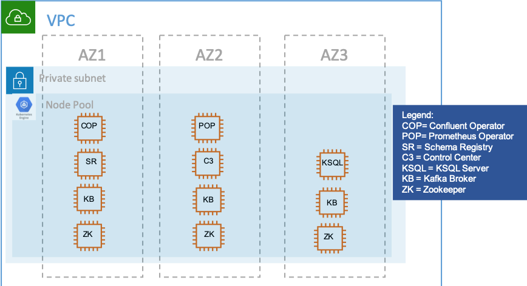

# GCP K8s with HiveMQ operator

Applying this terraform deployment will create a K8s cluster with the following deployed:

* Tiller
* Prometheus Operator & Prometheus
* metrics-server for Kubernetes metrics in dashboard
* K8s dashboard (use `gcloud config config-helper --format=json | jq -r ‘.credential.access_token’` for login)
* Confluent Operator
* Confluent Cluster running in one Zone with only one replica of each component

It will also set your kubectl context to the gcp cluster automatically. (To undo this, see `kubectl config get-contexts` and switch to your preferred context)

# Requirements
The following components are required:

* jq: e.g. 'brew install jq'
* [kubectl](https://kubernetes.io/docs/tasks/tools/install-kubectl/): e.g. brew install kubernetes-cli (tested with 1.16.0)
* helm: e.g. `brew install kubernetes-helm` (tested with 2.14.3)
* [terraform (0.12)](https://www.terraform.io/downloads.html): e.g. brew install terraform
* [GCloud CLI](https://cloud.google.com/sdk/docs/quickstart-macos) (run `gcloud init` first)

The setup is tested on Mac OS X.

Make sure to have updated versions, e.g. an older version of helm did not work.

# Quick Start

1. Ensure account.json is in this folder. You will have to [create a service account](https://cloud.google.com/iam/docs/creating-managing-service-account-keys) on GCP first. Choose the right roles and enable google API. If something is missing terraform let you know.

2. Choose a GCP project or create a new one on your cloud console. Terraform will prompt you to specify your project name when applying.

3. Before starting terraform: change the file [variables.tf](variables.tf). Here you will find entries which have to fit with your environment. You have to set the right region, the node count and preemptible_nodes.
During the terraform deployment the Confluent Operator (Version v0.65.1) will be downloaded ([The logic is in setup.sh](setup.sh)). If there is newer version please update the link in setup.sh.
We use Google Cloud Confluent Operator template [gcp.yaml](gcp.yaml) for installing the Confluent Platform into GKE created K8s cluster. The template is copied into the new downloaded Confluent Operator Helm-Chart-Producer directory(confluent-operator/helm/provider). Please change this file [gcp.yaml](gcp.yaml) for your setup. We use Cloud Region=europe-west1 and Zones=europe-west1-b, europe-west1-c, europe-west1-d. RThe replicas for Kafka Broker and Zookeeper are set to 3 all other replicas=1.
The following setup will be provisioned:

The script [00_setup_GKE.sh](00_setup_GKE.sh) will create the GKE cluster. This script will be executed automatically via terraform. If the cluster is up and running execute the scripte [01_installConfluentPlatform.sh](01_installConfluentPlatform.sh) manually.

4. First Step: Create the environment in Google Cloud: Create the GKE Cluster (you have to enter the project name)
```bash
# create the GKE Cluster
terraform init
terraform plan
terraform apply
```
5. Second Step: Install the Prometheus and Confluent Operator and setup the Confluent Platform in GKE 
It is really important that the GKE cluster is up and running. Sometimes it takes a while, because GKE doing automatic upgrades. That's why we decide to split setup into two pieces. First you create the GKE cluster with terraform and then execute the deployment of the Confluent Platform in a send step:
```bash
# Deploy prometheus and Confluent Operator
./01_installConfluentPlatform.sh
```
After the script execution please check again if Confluent Platform cluster is running:
```bash
kubectl get pods -n operator
# Output should look like this
NAME                          READY   STATUS    RESTARTS   AGE
cc-manager-5c8894687d-j6lms   1/1     Running   1          11m
cc-operator-9648c4f8d-w48v8   1/1     Running   0          11m
controlcenter-0               1/1     Running   0          3m10s
kafka-0                       1/1     Running   0          8m53s
kafka-1                       1/1     Running   0          7m31s
kafka-2                       1/1     Running   0          6m6s
ksql-0                        1/1     Running   0          6m
schemaregistry-0              1/1     Running   1          6m53s
zookeeper-0                   1/1     Running   0          10m
zookeeper-1                   1/1     Running   0          10m
zookeeper-2                   1/1     Running   0          10m
```
# Kubernetes Dashboard

* Run `kubectl proxy &`
* Go to [K8s dashboard](http://localhost:8001/api/v1/namespaces/kubernetes-dashboard/services/https:kubernetes-dashboard:/proxy/)
* Login to K8s dashboard using The token from `gcloud config config-helper --format=json | jq -r '.credential.access_token'`

# Grafana Dashboards

* Forward local port to Grafana service: `kubectl port-forward service/prom-grafana 3000:service`
* Go to [localhost:3000](http://localhost:3000) (login: admin, prom-operator)
* Dashboards will be deployed automatically (if they are not visible, bounce the deployment by deleting the current Grafana pod. It will reload the ConfigMaps after it restarts.)

# Confluent Platform
Follow the examples of how to use and play with Confluent Platform on GCP K8s on [Confluent docs](https://docs.confluent.io/current/installation/operator/co-deployment.html)

# Destroy Infrastructure

* Run 'terraform destroy' to stop and remove the created Kubernetes infrastructure
```bash
./03_deleteConfluentPlatform.sh
# destroy the GKE Cluster, enter the project name
terraform destroy
```
manually
* Double check in Google Cloud Console if everything is destroy: 
  Kubernetes Engine, Compute Engine and under Compute Engine please check also Disks and Instance Groups.
* (HINT): 
  If the destroy takes more than 10 minutes then terraform is throwing an error. 
  Then you have to destory manually via Google Cloud Console.
  * delete instance groups in Compute Engine
  * delete not attached Disks in Compute Engine
  * Delete cluster in Kubernetes Engine